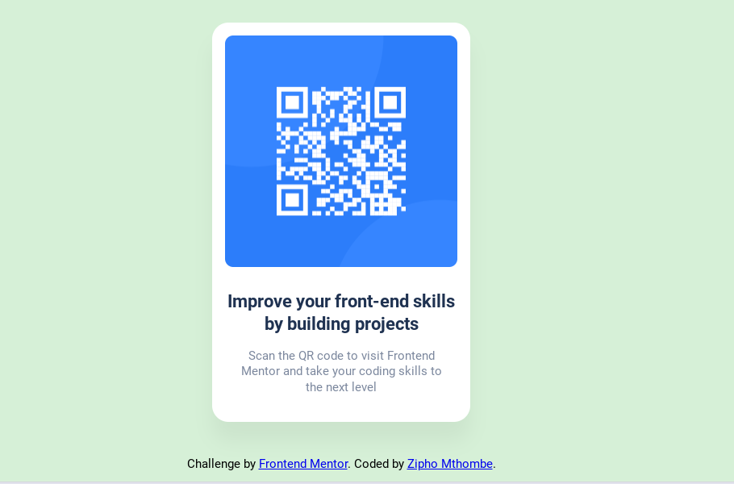

# Frontend Mentor - QR code component solution

This is a solution to the [QR code component challenge on Frontend Mentor](https://www.frontendmentor.io/challenges/qr-code-component-iux_sIO_H). Frontend Mentor challenges help you improve your coding skills by building realistic projects. 

## Table of contents
  - [Links](#links)
  - [Built with](#built-with)
  - [Author](#author)

### Links

- Solution URL: [https://www.frontendmentor.io/solutions/i-use-html5-css-only-uhI1yimTqR](https://www.frontendmentor.io/solutions/i-use-html5-css-only-uhI1yimTqR)
- Live Site URL: [https://ziphozenkosimthombe.github.io/frontend_mento_challange/](https://ziphozenkosimthombe.github.io/frontend_mento_challange/)

### Built with

- Semantic HTML5 markup
- CSS custom properties
- CSS Grid

## Authorhttps://zipho.netlify.app/

- Website - [zipho.netlify.app](https://zipho.netlify.app/)
- Frontend Mentor - [@Ziphozenkosimthombe](https://www.frontendmentor.io/profile/Ziphozenkosimthombe)
- Twitter - [@ziphozenkosi478](https://www.twitter.com/ziphozenkosi478)

